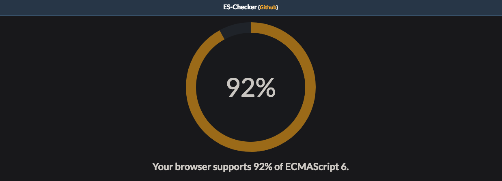
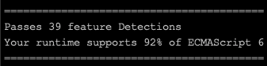

这一课的内容，带你走进 Node 的世界，相对而言，它是一门比较年轻的技术，而非编程语言。与 Java 和 PHP 的概念不一样，Node 使用的的编程语言是 JavaScript ，这么一说，更让人糊涂了，那 Node 到底是什么样的一个存在？且听我慢慢道来。 

### Node 的定义
看一下维基百科上的定义。

>  Node.js 是一个能够在服务器端运行 JavaScript 的开放源代码、跨平台 JavaScript 运行环境。Node.js 由 Node.js 基金会持有和维护，并与 Linux 基金会有合作关系。Node.js 采用 Google 开发的 V8 运行代码，使用事件驱动、非阻塞和 异步输入输出模型等技术来提高性能，可优化应用程序的传输量和规模。

根据上述的定义，我们提出如下概念：

- Node 是 JavaScript 的服务器运行环境（runtime）
- Node 采用 Google 开发的 V8 引擎运行代码
- Node 采用事件驱动，非阻塞和异步 I/O 模型

一句话总结一下，Node 是采用**事件驱动**，**非阻塞异步 I/O** 模型，运行在 V8 引擎下， JavaScript 语言在服务器端的运行环境。关于事件驱动，非阻塞异步 I/O 等概念，会在后续的课程中详细介绍到。

### Node 的诞生
Node 诞生于 2009 年，他的作者 Ryan Dahl 起初想要创建一个高性能的 Web 服务器并提供一套库。想要创建高性能的 Web 服务器，至少要具备两个条件：**事件驱动**，**非阻塞异步 I/O**。

于是，他的目标就是要写一这样的 Web 服务器，而他并不想重新再创造一门编程语言，那么使用什么编程语言呢，这是一个问题。他本身是 C/C++ 程序员，然而他认为 C++ 的门槛太高了，很多开发者可能并不想去做实际的业务开发，而基于 **事件驱动**，**非阻塞异步 I/O** 这两点的考虑，衡量了 Ruby，Haskell 等语言后，他最终选择了 JavaScript 作为它的语言。

在此之前，JavaScript 只是一门在浏览器环境下运行的语言，它的学习门槛非常低，而在服务器端几乎没有市场，可以说「这是一片净土」，为它倒入一套「非阻塞异步 I/O 库」要容易得多了。另外一个重要的原因，JavaScript 在浏览器环境下，就已经广泛的使用了「事件驱动」，像页面按钮的监听点击动作，页面加载完成事件等等，都是「事件驱动」方面的应用。

正是因为 JavaScript 这三个方面的优势：
1. 学习门槛低
2. 无太多阻力构建非阻塞异步 I/O 模型
3. 事件驱动的天然优势

让 JavaScript 成为了 Node 的实现语言。而在浏览器大战中，Google 的 Chrome 浏览器 JavaScript V8 引擎一战成名，于是 Node 采用高性能的 V8 作为运行环境，也就顺理成章了。

说到这里，相信你已经大概了解 Node 定义中的那段话，接下来的问题是，它能做什么呢？

### Node 的用途
其实，我比较反感去回答，某个语言能做什么？我认为这是一个特别没有意思的问题，比如，有点人可能会说，我要做爬虫，所以我要学 Python，我要学开发网站，所以我要学 PHP 和 Java。这其中，其实没有任何的因果关系，有关系的只是你掌握的程度。

就如 Ryan Dahl 想要一个高性能的 Web 服务器，他的选择是创造了 Node，使用了 JavaScript 语言。在此之前，你如果要问 JavaScript 能做什么？得到的答案应该是：让网页动起来。**而如今，你几乎可以使用 JavaScript 做任何事情**。

好了，我们换个问法，Node 适合做什么？前面介绍了，它是一个高性能的 Web 服务器， 采用的是事件驱动，异步I/O模型，那么它的优势就在 Web，高性能 I/O 上面，于是它擅长做如下应用：

- Web 服务 API（ REST ）
- 服务端 Web 应用，高并发请求
- 即时通信应用
- 静态文件服务器（ I/O 类）
- ......

擅长的应用可能多了去了，那么，它不擅长什么？

发展之初的时候，由于单线程的弱点，我可能会说，它不适合在多 CPU 架构服务器上运行（因为他是单线程的），不适合做大规模计算类的应用（因为单线程，一旦 CPU 被计算阻塞，异步也就白扯了），但是，如今这些曾经的问题，都已经不是问题了，Node 引入了 child_process 子进程模块，解决单线程问题。

所以，Node 的用途是非常广泛的，想做爬虫，使用 Node 也是可以实现的，想做 Web ，Node 更是可以胜任。

在我看来，其他编程语言也都一样，他们只是一个工具，为我们服务的工具，问题是我们能不能用好这个工具，而不是工具本身的问题，当然，也不可否认工具是否合适的问题。**在有了 Node 之后，如今的 JavaScript 几乎可以做任何事情**。

### 闲聊：JavaScript 的那些规范
你已经知道了，Node 只是 JavaScript 在服务器端的运行环境，所以，在使用 Node 开发过程中，我们使用的是 JavaScript 这门语言，鉴于它的特殊性，以及历史渊源，我觉得还是有必要聊一聊，关于 JavaScript 的一些规范。

JavaScript 语言的缔造者「网景」公司，希望 JavaScript 语言能够成为国际标准，最开始交给标准化组织 ECMA 去制作规范，由于与 Java 商标等因素，ECMA 组织发布的这套规范，不叫 JavaScript ，而是叫 ECMAScript，这就是 ECMAScript 的由来，也是最初的 JavaScript 语言的官方规范。

ECMAScript 5.1 到 6.0 版本的时候，ECMA 标准化组织想让发布标准变成一个常规流程，于是规定每年 6 月份的时候发布一次正式版本，不再沿用旧版本号来记录，直接以当年年份作为名称，例如：ECMAScript 2018，简称 ES2018，就是在 2018 年 6 月发布的最新一版。以这种规则发布的第一个版本是在 2015 年 6 月，它是 5.1 到 6.0 的第一个版本，称作 ES2015 ，也称作 ES6，由于这一次的变化非常大，所以，ES6 泛指下一代 JavaScript 标准。

我们都知道，在 Node 诞生之前，JavaScript 一直主要应用于浏览器端，它在服务器端的作为，几乎可以忽略不计。所以 ES6 标准之前，JavaScript 的规范都受限于浏览器端的环境，所以，它的官方规范是相当薄弱的，都不能称作为一个完整的语言。

而 CommonJS 就在这种背景下，由 JavaScript 开发者社区共同制定出来了，它定义了 JavaScript 语言的模块系统，Buffer，I/O处理，Web 服务器接口等等规范，填补了 JavaScript 在服务器端的空缺，Node 正是借助了 CommonJS 的一些规范，迅速在服务器端打开市场。

随着时间推移，各大浏览器对 ES6 的支持以及 Node 的发展，ES6 正式成为下一代 JavaScript 语言的国际标准。

> 查看浏览器对 ES6 的支持程度
访问：http://ruanyf.github.io/es-checker/

> 查看你当前 Node 环境对 ES6 的支持程度
- `npm i -g es-checker` 安装检测模块
- `es-checker` 运行模块

---
参考资源：[ECMAScript 6 入门 - 阮一峰](http://es6.ruanyifeng.com/)