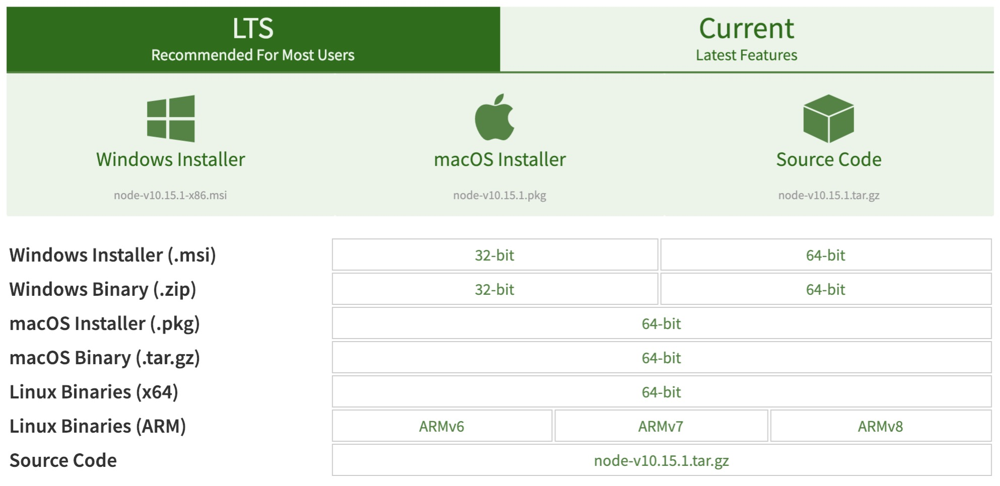

从这一节课程开始，就正式进入开发实战中。工欲善其事，必先利其器，要开始学习 Node 开发了，Node 的环境一定要准备好。这一节课程的主要内容是 Node 环境的安装，以及编写属于 Node 的「Hello, World」。

## Node 环境

Node 是全平台支持的，官方提供了下载地址，分为长期版本以及当前版本，初学者建议安装长期版本，截止到写该篇文章为止，Node 的长期版本号为：10.15.1，我们打开官方下载页面：[Download \| Node.js](https://nodejs.org/en/download/)



Windows 平台和 Mac 平台直接下载对应的软件包，然后双击安装即可。

这里主要介绍一下 Linux 平台的安装，如果你使用的是 Ubuntu 系统的话，有可能会发现，通过 `sudo apt install node` 命令是无法安装的，那是因为 apt 库里没有该软件包。如果是这种情况，我们就需要自己下载软件包进行安装。下载 Linux 编译好的软件包，即上面的 `Linux Binaries` 的版本，注意别下成源码了，源码编译太慢了（别问我怎么知道了）。

命令行界面，我们使用 wget 下载，命令如下：

```bash
wget https://nodejs.org/dist/v10.15.1/node-v10.15.1-linux-x64.tar.xz
```

以上是 10.15.1 长期版本的下载链接，如果版本有更新，请到官网找到最新的下载链接。下载到当前目录后解压，命令如下；

```bash
tar -xvf node-v10.15.1-linux-x64.tar.xz
```

解压出来一个目录，进入 bin 目录，你会发现直接就能用了。这就是 Linux 的魅力，基本都是绿色软件。我们转移一下软件目录，我一般的习惯是剪贴到 /usr/local/ 目录下，命令如下：

```bash
mv node-v10.15.1-linux-x64/* /usr/local/node
```

最后，编写 ~/.zshrc 文件，添加 PATH ，这样你就可以在任何目录下访问 `node` 以及 `npm` 命令了。`vim ~/.zshrc` 编辑文件，在任何地方添加一行：

```bash
export PATH=$PATH:/usr/local/node/bin
```

> 另外，Mac 用户还可以通过 bower 来安装 Node ，通过命令 `bower install node` 即可。

Node 环境安装完成之后，在命令行处输入 `node -v`，显示版本号，即表示安装成功。于此同时，你也拥有了，目前最大的前端包管理器，它就是 [npm](https://www.npmjs.com/) 。

它的强大之处，就在「有事没事，上去搜一下，只有你想不到的，没有它没有的」。开发过程中，很多时候，你觉得很麻烦的地方，没准别人早就做好模块，等着供你使用了。

学习以下命令，基本就满足开发需要了。

* `npm -l` 查看命令帮助
* `npm install --save xxx` 安装到项目目录中
* `npm install -g xxx` 全局安装，之前安装的 `supervisor` 以及 `express-generator` 就是这类
* `npm ls xxx` 查看当前目录是否安装该依赖
* `npm search xxx` 搜索依赖包

> 以上 install 可缩写成 i

## supervisor

什么是 supervisor？它是一个进程管理工具，当线上的 Web 应用崩溃的时候，它可以帮助你重新启动应用，让应用一直保持线上状态。听起来，开发阶段貌似没有啥用呀，其实不然，开发阶段更需要它。

开发的时候，当修改后台代码后，我们需要重启服务，以便及时看到最新的效果，如果没有它，我们需要修改一段代码，就要手动重启一下服务，效率就低下了。

安装方法很简单，在命令行中，输入 `npm i -g supervisor` 即可。安装完成之后，我们就可以使用 `supervisor` 命令来替代 `node` 命令启动项目了，当项目中代码变化时，`supervisor` 会自动帮我们重启项目。

## Hello, Node

Node 安装完成之后，我们在命令行处输入 `node`，会出现命令行交互界面，我们输入 `console.log('Hello, World!')` 回车，将会在控制台，打印出 Hello, World! 的字样。如下图所示：


如果我说，这就是 Node 的「Hello, World」程序，你一定会质问，这算什么呀？在浏览器命令行里，输入同样的代码，也会出现相同的结果，这明明是 JavaScript 语言的「Hello, World」，跟 Node 有半毛钱关系呀。


没错，如果拿这个冒充 Node 的「Hello, World」，一定会让人瞧不起的。现在就来看看，属于 Node 的 「Hello, World」，上面提到过，Node 的诞生，最初是为了成为一个高性能的 Web 服务器，所以，它的优势当然在 Web 上。且看下面一段代码：

```javascript
const http = require('http');
http.createServer(function(req,res){
    res.setHeader('content-type', 'text/plain');
    res.end('Hello, World!');
}).listen('3000');
console.log('Server is started @3000');
```

先不着急明白代码的含义，先在编辑器上敲出如上代码，然后保存到本地，命名为 helloworld.js ，然后到终端中，使用 `supervisor helloworld.js` 命令运行代码，终端显示如下：


如果上述环境安装都没有问题的话，你的服务已经在本地 3000 端口跑起来了，打开浏览器，输入网址：[http://localhost:3000](http://localhost:3000) 你将会看到，属于 Node 的 「Hello, World」程序。

我们修改一下代码，将打印的文本替换成 「Hello, Node!」，在终端处，你会看到服务自动重启，如下图：


这就是 supervisor 的作用。

## 小结

这一节课程，我们正式走入的 Node 开发之旅。

* 首先，我们在 Node 官网上，找到了 Node 环境的安装方法，并且详细介绍了 Linux 环境下的安装步骤；
* 然后，通过 NPM 包管理器，安装了我们的第一个工具：supervisor，它能够帮助我们不断的重启服务，当我们修改了代码之后；
* 最后，我们写出了属于 Node 的 「Hello, world」程序，正式进入 Node 开发。

