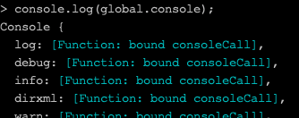
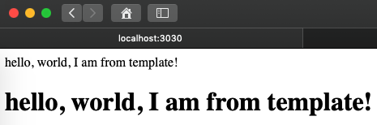

上一节课程，我们写出了 Node 的「Hello, World」程序，但是我们还不知道它具体是什么原理。这篇课程，就从「Hello，World」的这段代码着手，带你了解 Node 的模块机制及规范。

一段简单的代码，如果真的要深入去挖掘，你会发现，其实并没有你想象的那么简单，我们再来看看这段代码。

```javascript
const http = require('http');
http.createServer(function(req,res){
    res.setHeader('content-type', 'text/plain');
    res.end('Hello, World!');
}).listen('3000');
console.log('Server is started @3000');
```

假如我是一个初学者，我有很多的问题想要问：

1. require 是什么？
2. http  是什么？
3. createServer 方法定义的是什么？
4. createServer 方法里竟然传入了一个 function，这是什么操作？
5. req, res 各自是什么？
6. console 又是什么？

你看，短短 6 句代码，随随便便就能问出这么多问题，而且都还不算深入的，这些问题真要深入去研究，几乎都可以当作一个课题，因为它涉及到了 HTTP 模块 API、CommonJS 规范、事件驱动、函数式编程等等概念。这里我们先不着急去回答这些问题，我们依然从 Node 的基础概念入手。

## 模块的起源

在 JavaScript 语言还只是在浏览器端应用的时候，几乎没有模块概念的，这一块的缺失，使得 JavaScript 这门语言很难承担大型项目的责任，为什么这么说呢？

在大型项目中，我们通常需要将各个功能模块拆开，形成一个一个组件，或者更小的功能模块，一来为了代码的复用，二来可以降低各个功能模块间的耦合性，从而减少二次维护成本。所以，一门语言具备合理的模块机制，在大型项目开发中就显得至关重要。

在第一节谈到 JavaScript 的那些规范的时候，提到过，JavaScript 很多关于后台开发的规范，都源自于 CommonJS，Node 也正是借助了 CommonJS ，从而迅速在服务器端占领市场。那么 CommonJS 的模块机制到底定义些什么内容呢？

## 模块的规范

### 什么是模块？

> 每一个文件都是一个模块，其中定义的变量、函数以及类都是**私有的**，所以模块内部定义的变量，只在该模块作用域下，不会污染全局作用域

示例：我们创建一个 `template.js` 文件，写上如下代码：

```javascript
var http = 'hello, world, I am from template!';
var changeToHeader = () => {
    return '<h1>' + http + '</h1>';
}
```

这里定义两个变量，它的作用域只在 template 模块中，不会影响其他地方定义的 http 和 changeToHeader 变量。

### global？

> global 是顶层对象，其属性对所有模块共享，但由于作用域污染问题，不建议这么使用

从这里我们就知道了，为什么 console 都没有定义，就能直接使用了，因为在 Node 中，它是直接「挂靠」在 global 顶层对象下的「一等公民」，`console` 也等同于 `global.console`，在终端里，我们执行 `console.log(global.console)`，打印 console 对象看看，得到如下结果：



第一个变量，就是上述我们使用的 log 方法。

### 如何导出模块？

> module 对象代表当前模块，它的 exports 属性（即 module.exports）是对外的接口，加载某个模块，其实是加载该模块的 module.exports

我们想要把 template 中的 changeToHeader 导出为对外的模块，于是在 template.js 中，最后加上一句代码即可。

```javascript
module.exports = changeToHeader;
```

### 如何加载模块？

> 加载模块使用 require 方法，模块的加载是单次的，只会加载一次，之后就会被缓存

上面已经把 template 导出为对外模块了，我们在 helloworld.js 中引入模块，修改代码如下：

```javascript
const http = require('http');
const template = require('./template.js');
http.createServer(function(req,res){
    res.setHeader('content-type', 'text/html');     // 这里修改成了 html
    res.end(template('Hello, Node!'));    // 这里使用 template 模块
}).listen('3030');
console.log('Server is started @3030');
```

如果你的服务没有杀掉，这会应该自动重启了，浏览器打开 [http://localhost:3030](http://localhost:3030) ，将会看到如下结果：


我们刚刚完成了，模块的导出以及引用。

### module.exports 和 exports 区别？

module.exports 属性表示当前模块对外输出的接口，上面已经讲到了，假如我想将多个方法或者变量对外开放，该如何操作？聪明如你，可能已经想到下面的方法：

```javascript
var http = 'hello, world, I am from template!';
var changeToHeader = () => {
    return '<h1>' + http + '</h1>';
}
console.log('loader from module template');
module.exports.changeToHeader = changeToHeader;
module.exports.http = http;
```

exports 本身也是对象，在对象上加属性是 JavaScript 再常规不过的操作了，我们把 http 变量也暴露出去，在 helloworld.js 中引用一下，如下：

```javascript
const http = require('http');
const template = require('./template.js');
http.createServer(function(req,res){
    res.setHeader('content-type', 'text/html');
    res.write(template.http);    // 返回模块 template 的 http 变量
    res.end(template.changeToHeader());    // 返回 changeToHeader() 方法
}).listen('3030');
console.log('Server is started @3030');
```

再刷新一下浏览器，出现结果：



跟我们想要的结果一致，但是，`module.exports.xxx = xxx` 这种写法太繁琐了吧。干脆不要了，直接写成这样：

```javascript
exports.changeToHeader = changeToHeader;
exports.http = http;
```

诶，还真可以，但也许并非你想象的那样，那是因为 Node 为我们做了一些事情。Node 为每个模块提供一个 exports 变量，指向 module.exports ，也就是说，在每个模块，都自动帮我们定义了一个变量 exports , 而且 `exports = module.exports`，这里等号是赋值的意思。有了这个定义，才有了上面省略 module 的写法。

有了这样的定义，我们要注意两点：

1. 不能给 exports 变量重新赋值，因为会覆盖掉 module.exports 对象；
2. 在使用 exports.xxx = xxx 导出 xxx 变量后，如果同时使用了 module.exports = yyy，将无法得到 xxx，因为 module.exports 被重新赋值了；

## 模块的分类

模块大体分为「核心模块」和「文件模块」。

### 核心模块

核心模块是 Node 直接编译成二进制的那一类，这类模块总是会被优先加载，例如上述的 http 模块。在引用的时候，也最为方便，直接使用 require\(\) 方法即可。

### 文件模块

文件模块就是我们自己编写的或是他人编写的，我们自己编写的模块，一般都是通过文件路径进行引入，例如上述：

```javascript
const template = require('./template.js');    
// .js 可以省略，如果找不到 Node 会自动加上 .js .json .node 进行查找
```

引用他人编写的模块，通常情况下，都是通过 npm 包管理器来安装，安装命令：`npm i xxx --save`，会自动将模块安装到项目根目录 node\_modules 下，引用的时候，直接 require\('xxx'\) 即可，同核心模块引用方式一样。假如没有找到模块，Node 会自动到文件的上一层父目录进行查找，直到文件系统的根目录。如果还没有找到，则会报错找不到。

## 小结

到这里，相信你对 Node 模块机制有了初步的了解，它给我们提供了一种便捷的方法，来组建我们的项目。这一节课程里，我们了解到 Node 的模块机制来源于 CommonJS 规范，在 CommonJS 规范中定义了关于 global、module、exports 以及 require 等功能。

回到我们最开始的问题，相信你已经能够回答「什么是 require？什么是 http？什么是 console？」这类问题了。

* require 是挂在 global 对象下的方法，它一般用于加载其他模块
* console 是挂在 global 下的对象，它封装了控制台的一些功能
* http 是 Node 定义的核心模块，给我们提供了关于 HTTP 请求的功能

> PS. 关于 CommonJS 的模块规范，远不止上述这些内容，如有兴趣，可自行再深入学习。

